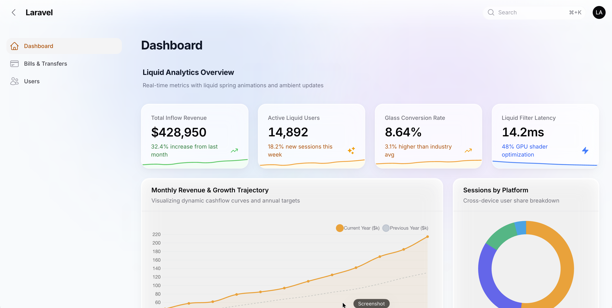
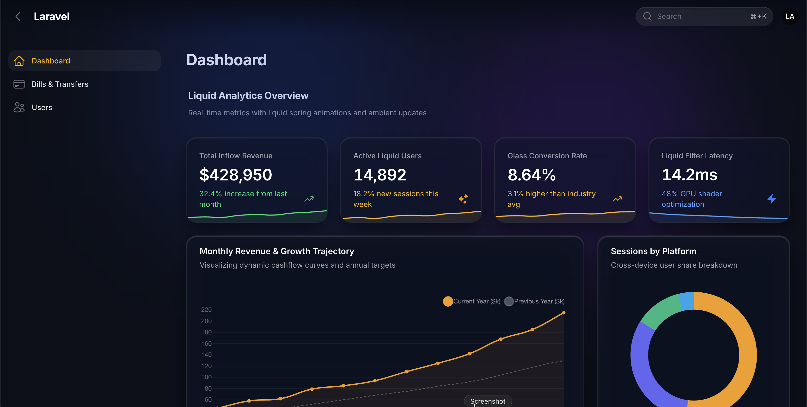
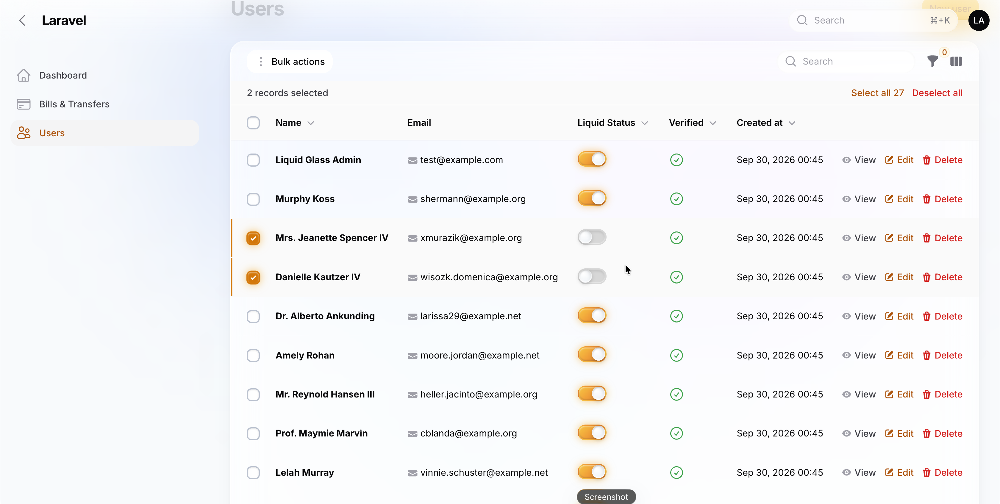
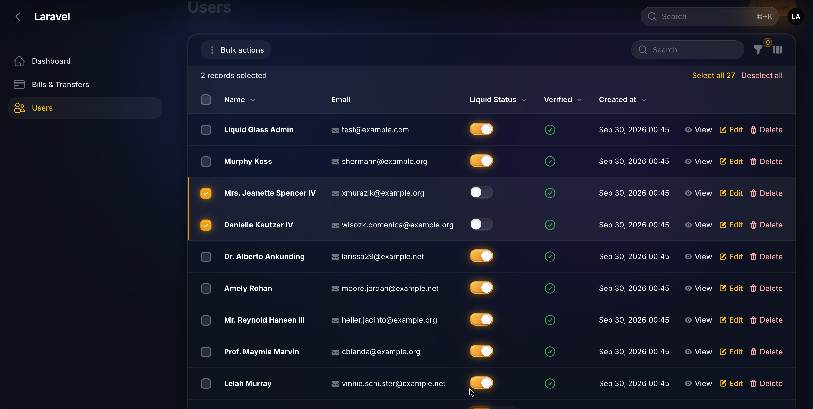
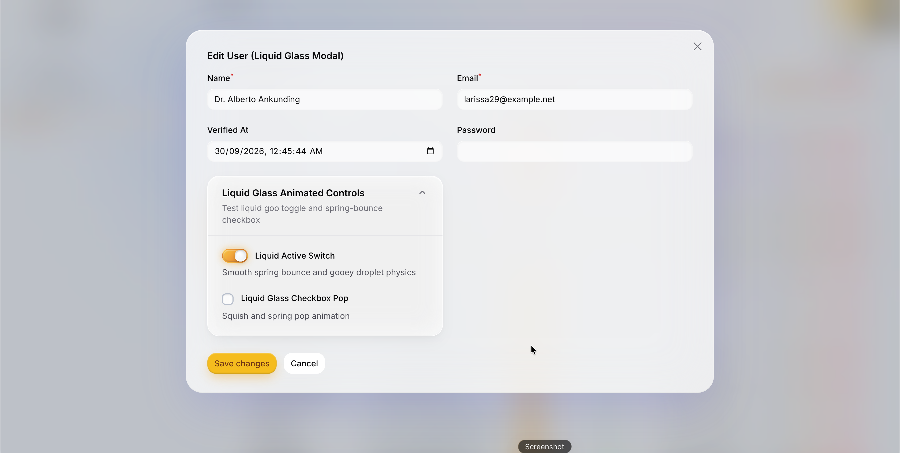
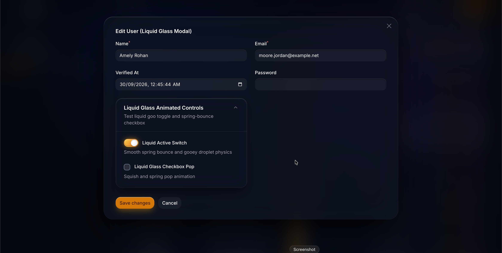
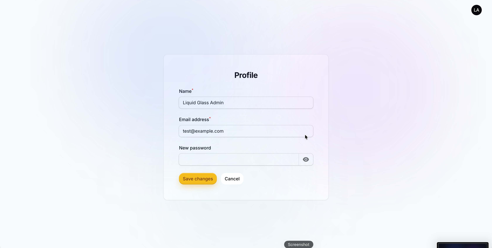
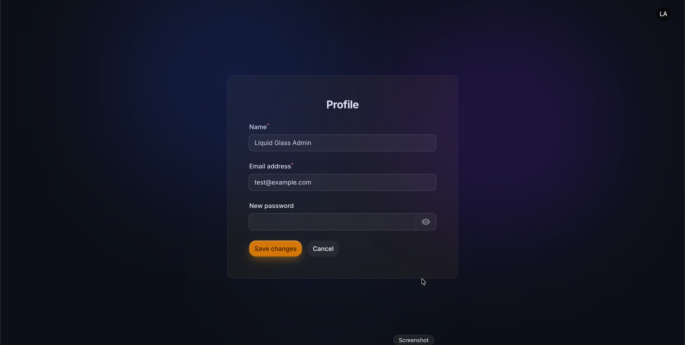

# Cyber Glass Theme for Filament

A premium, futuristic **Cyber Glass & Liquid Glassmorphism** theme and UI plugin for **Filament 5** & **Laravel 11/12**, featuring authentic SVG chromatic dispersion, progressive blur headers, and physics-driven liquid interactions.

[](LICENSE.md)
[](https://filamentphp.com)
[](https://php.net)

---

## Overview

**Cyber Glass** is a next-generation, premium UI theme and enhancement suite designed exclusively for **Filament 5** and **Laravel 11/12**. Drawing deep inspiration from state-of-the-art fintech platforms like Revolut Business, high-end Apple glassmorphism, and cyberpunk optical aesthetics, Cyber Glass completely transcends conventional dashboard themes by introducing true optical physics and tactile fluidity to your admin panel.

Unlike basic backdrop-filter skins that merely tint containers, Cyber Glass features an authentic SVG-powered chromatic dispersion pipeline, specular refraction borders, and multi-layered depth. Every surface—from data tables and metric stat cards to slide-over drawers and dialog modals—radiates luminous refraction while maintaining flawless typographic legibility in both light and dark modes. An ambient cyber mesh aura gently illuminates the canvas background, harmonizing dynamically with your configured Filament primary color palette.

Where Cyber Glass truly comes alive is in its physics-driven liquid interactions. Form elements are treated as fluid entities: toggle switches mimic mercury droplets sliding across frictionless glass with 22-stop spring elasticity; checkboxes pop with buoyant tactile feedback; and action buttons exhibit gelatinous squash-and-stretch compression accompanied by liquid light sweep beams on hover. The signature progressive faded header dissolves seamlessly from a crystalline top blur into an imperceptible mist, allowing dashboard content to glide effortlessly underneath.

Engineered with pure CSS performance, hardware-accelerated transforms, and non-intrusive blade render hooks, Cyber Glass delivers a breathtaking, AAA-grade software aesthetic without sacrificing execution speed, responsiveness, or core Filament functionality. Elevate your application into a mesmerizing, luxury-grade digital experience that commands attention from the very first click.

---

## 📸 Visual Showcase (Light vs. Dark Mode)

Experience the ultra-clean, high-contrast aesthetics in both Light and Dark modes.

### 📊 1. Analytics Overview & Dynamic Charts
| Light Mode | Dark Mode |
| :---: | :---: |
|  |  |

### ⚡ 2. Interactive Data Tables & Liquid Controls
*Featuring liquid mercury toggles, crystal-clear checkboxes, and ambient row highlights.*
| Light Mode | Dark Mode |
| :---: | :---: |
|  |  |

### 🪟 3. Cyber Glass Dialog Modals & Form Controls
*Specular glass refraction borders, non-intrusive backdrop blur, and squash-and-stretch buttons.*
| Light Mode | Dark Mode |
| :---: | :---: |
|  |  |

### 👤 4. Floating Account & Profile Glass Panels
| Light Mode | Dark Mode |
| :---: | :---: |
|  |  |

---

## Features

- **Cyber Ambient Mesh Glow**: Ethereal multi-stop radial glow orbs dynamically harmonized with your Filament panel's primary color palette in both light and dark modes.
- **Progressive Faded Blurred Header**: Modern sticky topbar with a crisp blur at the top that dissolves gracefully into a transparent mist at the bottom edge.
- **Authentic Liquid Physics Interactions**:
  - **Liquid Mercury Toggles**: Fluid gelatinous spring animations matching your panel's primary color.
  - **Crystal Clear Checkboxes**: Pop-bounce elastic feel with primary glow accents.
  - **Dynamic Buttons**: Jelly compression and liquid light beam sweeps on hover.
  - **Cyber Glass Modals & Drawers**: Deep backdrop refraction with specular highlights and border diffusion.
- **Zero Configuration Necessary**: Works out of the box with Filament 5 panels with full customization capabilities.
- **100% Backward Compatibility**: Seamless drop-in replacement for `LiquidGlassPlugin`.

---

## Requirements

- **PHP**: ^8.2 or ^8.3
- **Laravel**: ^11.28 or ^12.0
- **Filament**: ^5.0

---

## Installation (Commercial / Private Setup)

Add this repository to your project's `composer.json`:

```json
"repositories": [
    {
        "type": "vcs",
        "url": "git@github.com:hellozedofficial/cyber-theme-filament.git"
    }
]
```

Then require the package:

```bash
composer require hellozedofficial/cyber-theme-filament:^1.0
```

Optionally publish the configuration file:

```bash
php artisan vendor:publish --tag="filament-cyber-glass-config"
```

---

## Usage

Register `CyberGlassPlugin` in your Filament Panel Provider (e.g. `app/Providers/Filament/AdminPanelProvider.php`):

```php
use CyberGlass\CyberGlassPlugin;

public function panel(Panel $panel): Panel
{
    return $panel
        ->default()
        ->id('admin')
        ->path('admin')
        ->plugin(
            CyberGlassPlugin::make()
                ->blur('16px')                         // Base glass blur intensity
                ->fadedHeader(true, '28px')            // Topbar progressive blur
                ->modalBlur('28px')                    // Center dialog modals
                ->slideOverBlur('32px')                // Slide-over drawer modals
                ->dropdownBlur('24px')                 // Dropdown popovers
                ->backgroundGlow(true)                 // Ambient cyber glow mesh
        );
}
```

---

## Configuration (`config/cyber-glass.php`)

```php
return [
    'enabled' => true,

    // Ambient Multi-Stop Background Mesh Glow
    'background_glow' => [
        'enabled' => true,
        'dark' => [
            'bg_canvas' => '#070b14',
            'royal_blue' => 'rgba(30, 64, 175, 0.32)',
            'blue_purple' => 'rgba(109, 40, 217, 0.22)',
            'ambient' => 'rgba(14, 165, 233, 0.15)',
        ],
        'light' => [
            'bg_canvas' => '#f3f6fa',
            'royal_blue' => 'rgba(37, 99, 235, 0.14)',
            'blue_purple' => 'rgba(139, 92, 246, 0.10)',
            'ambient' => 'rgba(14, 165, 233, 0.10)',
        ],
    ],

    // Faded Blurred Header
    'header' => [
        'faded_blur' => true,
        'blur_intensity' => '28px',
    ],

    // Cyber Modals
    'modals' => [
        'blur' => '28px',
    ],

    // Cyber Slide-overs
    'slide_overs' => [
        'blur' => '32px',
    ],

    // Cyber Dropdowns
    'dropdowns' => [
        'blur' => '24px',
    ],
];
```

---

## Commercial License

Copyright (c) HelloZed. All rights reserved.

This software is commercial and proprietary. Unauthorized copying, modification, redistribution, or sharing of this file/software, via any medium, is strictly prohibited without a valid commercial license agreement from HelloZed.
